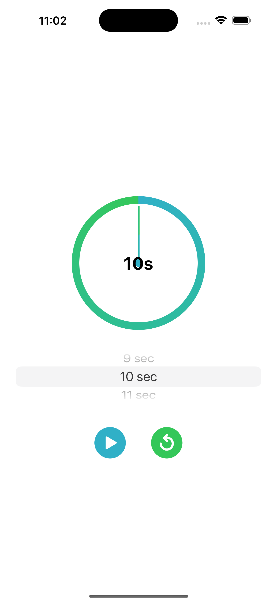
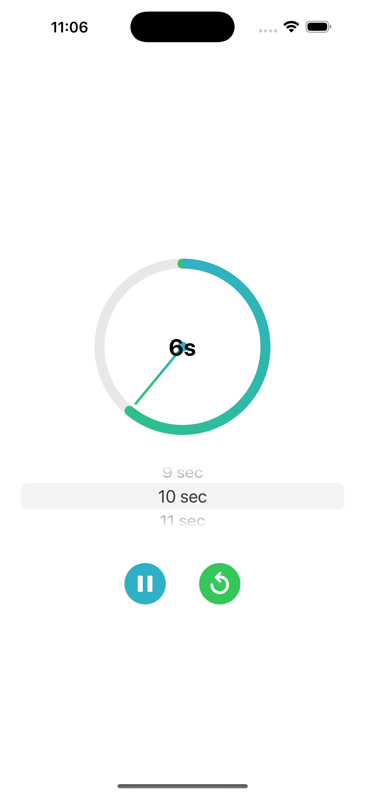
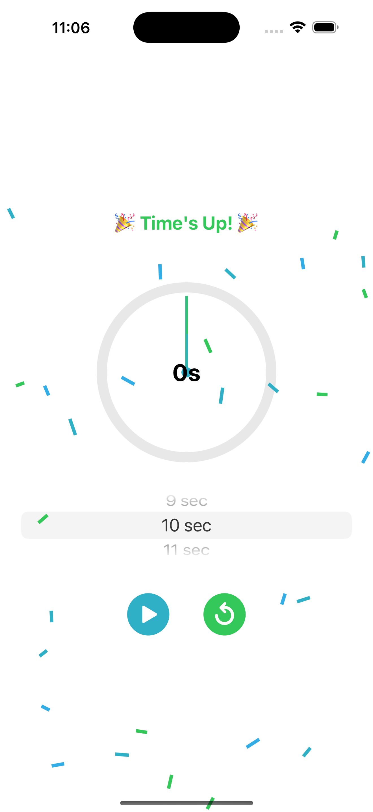

# ⏳ Circular Countdown Timer (SwiftUI)

A modern and interactive circular countdown timer built with **SwiftUI** featuring:
- Anticlockwise needle-style countdown
- Play / Pause / Reset controls
- Custom duration picker
- Completion sound
- Spaghetti-style confetti celebration 🎉

---

## 🚀 Features

- 🕒 **Circular Needle Timer** — Visually shows time remaining with a rotating needle and circular stroke.
- 🟢 **Teal Green Gradient Ring** — Clean and modern look using `LinearGradient`.
- ⏯️ **Play / Pause Functionality** — Tap to start or pause the countdown.
- 🔁 **Reset Button** — Reset timer anytime.
- ⌛ **Custom Duration Picker** — Select your own countdown duration.
- 🔊 **Completion Sound** — Play a system alert sound on completion.
- 🎊 **Spaghetti Confetti Celebration** — Fun visual burst when timer ends.

---

## 📷 Preview

| Circular Timer | Running Timer! | Confetti Celebration |
|:-------------:|:----------:|:--------------------:|
|  |  |  |

---

## 🛠 How to Use

1. **Clone or Download the Repo**
2. **Open in Xcode (15+)**
3. **Run on iOS Simulator or Device**

---

## 🧩 Components

- `CircularNeedleCountdownView.swift` – Main UI with timer and controls
- `SpaghettiConfettiView.swift` – Reusable confetti explosion animation
- Uses `AudioToolbox` for simple sound playback

---

## 🔊 System Sound Note

Currently uses `SystemSoundID(1005)` for completion (mail notification). You can change this to any available System Sound ID.

---

## ✨ Future Enhancements (Ideas)

- Haptic feedback on finish
- Store last used duration
- Dark mode support
- Multiple themes (fireworks, sparkles, balloons)

---

## 📄 License

MIT License. Feel free to use and modify.

---
